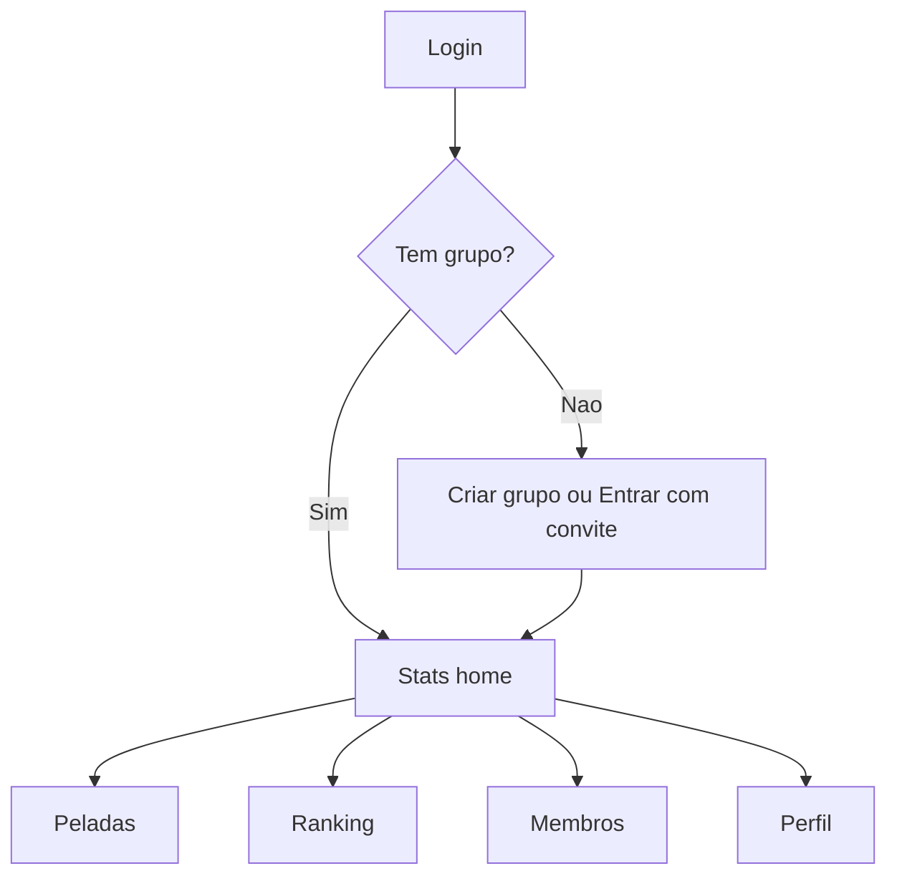
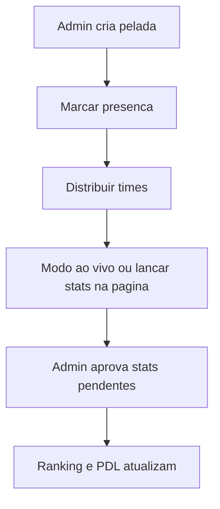
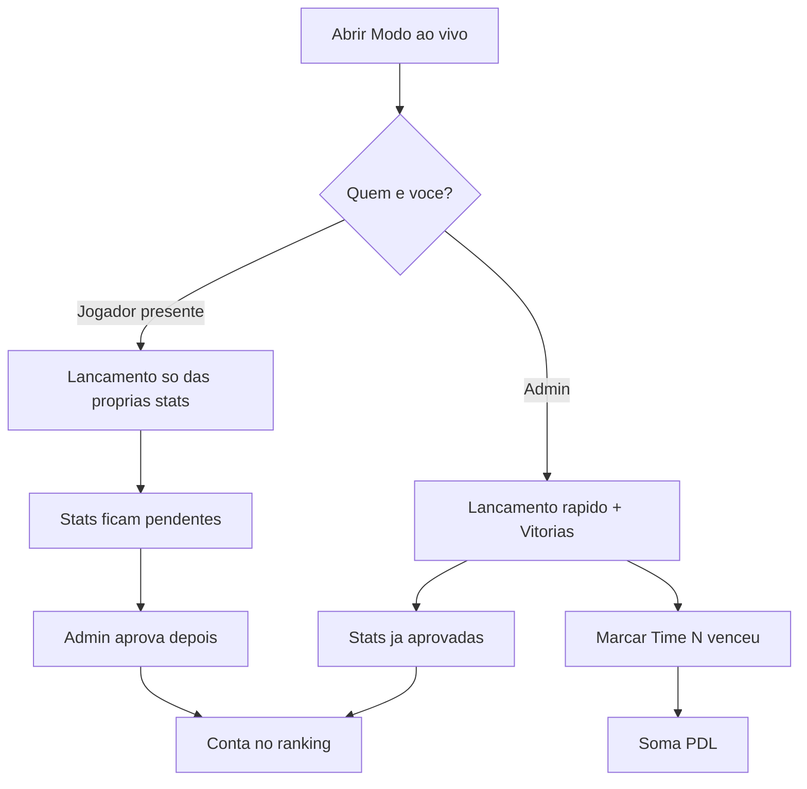
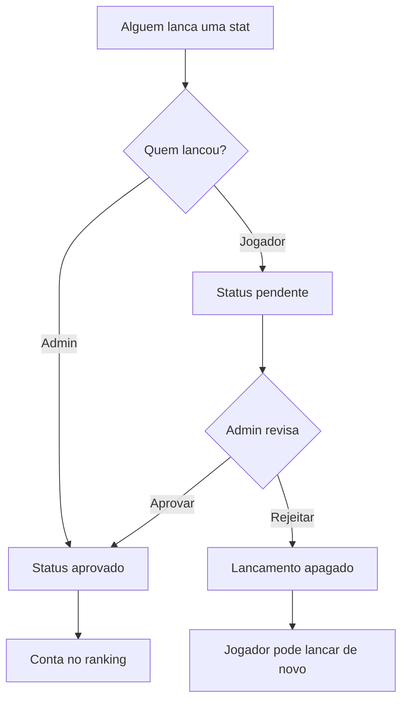
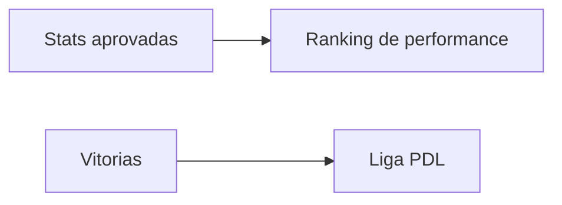
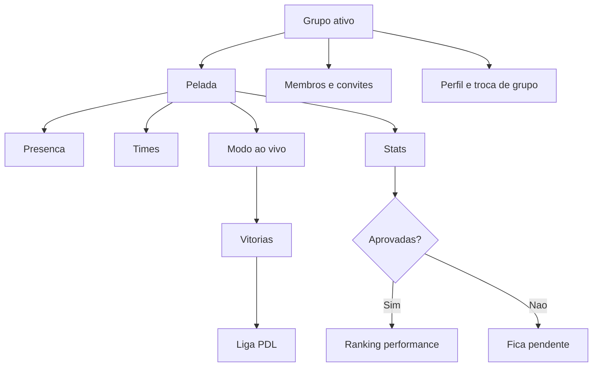

# Como funciona o Só no Pelo FC

Guia direto para quem já usa a plataforma e ainda se perde no fluxo do dia a dia.

Este documento explica a plataforma por inteiro, com foco em:

1. Criar e rodar uma pelada
2. Usar o Modo ao vivo
3. Entender estatísticas e rankings

---

## 1. Visão geral

O **Só no Pelo FC** organiza peladas de um grupo: presença, divisão de times, estatísticas e ranking.

Tudo gira em torno de um **grupo**. Você pode participar de vários grupos e trocar o grupo ativo no Perfil.

### Áreas principais

| Área | Onde fica | Para que serve |
|------|-----------|----------------|
| **Stats** | Home (`/dashboard`) | Seus números pessoais |
| **Peladas** | Menu Peladas | Criar/abrir peladas, presença, times, stats e modo ao vivo |
| **Ranking** | Menu Ranking | Ranking do grupo (performance + Liga PDL) |
| **Membros** | Menu Membros | Lista do grupo, fictícios, aprovações de apelido |
| **Perfil** | Menu Perfil | Conta, convites, troca de grupo, sair |



### Papéis

| Papel | O que faz na prática |
|-------|----------------------|
| **Dono** | Tudo que o admin faz + apagar grupo, transferir dono e configurar o elo máximo da Liga PDL |
| **Admin** | Criar peladas, marcar presença de qualquer um, distribuir times, lançar/aprovar stats, marcar vitórias, gerenciar membros |
| **Jogador** | Marcar própria presença, lançar próprias stats (pendentes), ver ranking e times |

Dono e admin têm os mesmos poderes no fluxo da pelada.

---

## 2. Grupo, convites e papéis

### Entrar na plataforma

1. Faça login com e-mail + PIN de 6 dígitos.
2. Se ainda não tiver grupo: **Criar grupo** ou **Entrar com convite**.
3. Quem cria o grupo vira **Dono**.

### Convidar pessoas

No **Perfil**, o admin/dono gera links de convite:

- Convite de **jogador**
- Convite de **admin**

Quem abre o link entra no grupo com o papel do convite.

### Trocar de grupo

Se você está em mais de um grupo, use o seletor de grupo no **Perfil**.  
Stats da home e Ranking usam o **grupo ativo**.

### Diferença prática no dia a dia

| Situação | Admin / Dono | Jogador |
|----------|--------------|---------|
| Criar pelada | Sim | Não |
| Marcar presença de outros | Sim | Só a própria |
| Distribuir times | Sim | Só visualiza |
| Lançar stats de qualquer um | Sim (já aprovado) | Só as próprias (pendente) |
| Aprovar stats | Sim | Não |
| Marcar vitória / PDL | Sim | Não |

---

## 3. Fluxo completo de uma pelada

Este é o fluxo principal da plataforma.



### Passo 1 — Criar pelada

**Quem:** Admin ou Dono.

**Onde:** Menu **Peladas** → card **Nova pelada**.

**Campos:**

| Campo | Obrigatório | Observação |
|-------|-------------|------------|
| Data | Sim | Já vem com a data de hoje |
| Mapa | Não | Link do Google Maps ou endereço |
| Descrição | Não | Ex.: “Treino de quinta” |

Ao salvar, a pelada abre na tela de detalhes.

### Passo 2 — Marcar presença

**Onde:** Na pelada → card **Presença**.

- Jogador: marca só a si com ✓ (vai) ou ✗ (não vai).
- Admin: pode marcar qualquer membro, ou usar **Confirmar todos**.

**Importante:** presença libera:

- lançamento de estatísticas
- entrada no sorteio de times (membros reais)
- uso do Modo ao vivo (para jogadores)
- registro de vitória / PDL

Jogadores fictícios não aparecem na lista de presença (eles entram direto no sorteio).

### Passo 3 — Distribuir times

**Onde:** Na pelada → card **Times**.

**Quem monta:** Admin.

1. Confirme presença (precisa de pelo menos 2 pessoas no pool).
2. Ajuste **Jogadores por time** (padrão: 5).
3. Clique em **Distribuir** (ou **Redistribuir**).
4. Se quiser, mova alguém manualmente entre os times.
5. **Limpar** apaga a distribuição.

O pool é: **presentes + jogadores fictícios**.  
O equilíbrio usa o score médio por pelada (novatos entram com 0).

Vitória por time no Modo ao vivo depende dessa distribuição.

### Passo 4 — Jogar e lançar stats

Duas formas:

1. **Modo ao vivo** (recomendado durante o jogo) — veja a seção 4.
2. Pela própria página da pelada:
   - Admin: card **Estatísticas (admin)** com +1 / −1
   - Jogador: card **Minhas estatísticas**

### Passo 5 — Aprovar stats pendentes

Se jogadores lançaram stats, o admin vê o card **Aprovações pendentes**.

- **Aprovar** → entra no ranking
- **Rejeitar** → apaga o lançamento (o jogador pode enviar de novo)

### Passo 6 — Ranking atualiza

Só entram no ranking as stats **aprovadas**.  
Vitórias alimentam a **Liga PDL** (separada do ranking de performance).

Não existe botão “encerrar pelada”. Quando terminar, é só sair da tela.

---

## 4. Modo ao vivo

Tela feita para usar durante o jogo, sem ficar navegando na pelada.



### Como entrar

Na página da pelada → botão **Modo ao vivo**.

Quem pode entrar:

- qualquer **admin/dono**
- **jogador com presença confirmada**

### O que o admin faz

Barra inferior com atalhos:

- **Gol**
- **Assistência**
- **God Save**
- **Deu o cu** (vacilo)

Ao tocar, abre a lista **“quem?”** e soma +1 para a pessoa (já **aprovado**).

Também pode marcar vitórias:

- **Time N venceu!** (se os times foram distribuídos) → +1 vitória para cada presente daquele time
- Ou vitória individual, se ainda não houver times
- Dá para desfazer (**Desfazer vitória** / **Desfazer última**)

### O que o jogador faz

Usa a mesma barra inferior, mas só para **si mesmo**.  
Cada toque cria um lançamento **pendente**. O admin precisa aprovar depois.

Jogador **não** marca vitória.

### Como sair

Use a seta de voltar (**Sair do modo ao vivo**).  
Não há “finalizar partida”.

### Dicas práticas

- Distribua os times **antes** se quiser marcar “Time N venceu”.
- Correção de −1 fica mais fácil na página da pelada (o modo ao vivo é focado em +1 rápido).
- Stats do jogador no ao vivo só contam no ranking depois da aprovação.

---

## 5. Como as estatísticas funcionam

### Quais stats existem

| Stat | Nome na tela | Quem lança | Entra no score de performance |
|------|--------------|------------|-------------------------------|
| Gol | Gol | Admin ou jogador | Sim |
| Assistência | Assistência | Admin ou jogador | Sim |
| Defesa destaque | God Save | Admin ou jogador | Sim |
| Vacilo | Deu o cu | Admin ou jogador | Sim (peso negativo) |
| Gol contra | — | Quase não usado na tela da pelada | Sim (peso negativo) |
| Vitória | Vitória | Só admin | **Não** (vai para a Liga PDL) |

### Fluxo de aprovação



Regras importantes:

1. Só stats **aprovadas** entram no ranking e na home de Stats.
2. Depois de aprovado, o **jogador não edita mais** — peça ao admin.
3. Para lançar stats, o membro precisa estar **presente**.
4. Admin pode corrigir com +1 / −1 na tela da pelada.

### Fórmula do ranking de performance

Cada grupo tem pesos (padrão abaixo). O admin pode alterar em Ranking.

```text
score =
  gols × 3
+ assistências × 2
+ god_saves × 2
+ vacilos × (-1)
+ gols_contra × (-2)
```

**Vitória não entra nessa conta.**

---

## 6. Dois rankings (não misture)

Na tela **Ranking** existem dois sistemas diferentes:

| | Ranking de performance | Liga PDL |
|--|------------------------|----------|
| O que mede | Qualidade do jogo (gols, assists, etc.) | Quantas vitórias você acumulou |
| Fonte | Stats aprovadas | Vitórias marcadas pelo admin |
| Pontos | Score ponderado | **+25 PDL por vitória** |
| Vitória muda? | Não | Sim |
| Nova temporada | Não zera | Zera o PDL |



### Elos da Liga PDL (padrão)

| Elo | PDL mínimo |
|-----|------------|
| Bronze | 0 |
| Silver | 300 |
| Gold | 700 |
| Platinum | 1200 |
| Diamond | 1800 |
| Immortal | 2500 |
| Radiant | 3300 |
| Challenger | 4200 |
| Elo máximo (padrão: **FENDA**) | 5200 |

O dono pode renomear o elo máximo.  
Começar uma **nova temporada** zera só o PDL; o ranking de performance continua.

---

## 7. Stats pessoais vs ranking do grupo

| | Stats (home) | Ranking |
|--|--------------|---------|
| Escopo | Seus números | Todo o grupo ativo |
| Filtro | Pode ver um grupo ou todos | Só o grupo ativo |
| Fictícios | Não entram no seu rank pessoal | Aparecem no ranking de performance |
| PDL | Resumo da sua temporada no grupo | Tabela completa da liga |

Resumo: a home responde “como eu estou?”; o Ranking responde “como está o grupo?”.

---

## 8. Membros e Perfil (resumo)

### Membros

- Ver o elenco do grupo
- Admin pode adicionar **jogadores fictícios** (convidados sem conta)
- Fictícios podem ter stats e entrar no sorteio, mas **não recebem PDL**
- Admin aprova pedidos de mudança de **apelido**

### Perfil

- Nome, apelido, foto
- Tema visual
- Trocar grupo ativo
- Gerar/copiar convites
- Sair do grupo / transferir dono / apagar grupo (conforme o papel)

---

## 9. Checklist do dia da pelada

### Admin / Dono

1. Criar a pelada em **Peladas** → **Nova pelada**
2. Marcar **Presença** (ou pedir para cada um marcar)
3. Em **Times**, clicar **Distribuir**
4. Abrir **Modo ao vivo**
5. Durante o jogo: lançar Gol / Assistência / God Save / Vacilo
6. Marcar **Time N venceu!** quando fizer sentido
7. Ao voltar, revisar **Aprovações pendentes**
8. Conferir **Ranking** (performance e Liga PDL)

### Jogador

1. Abrir a pelada do dia
2. Marcar **Presença** com ✓
3. Entrar no **Modo ao vivo** (ou em **Minhas estatísticas**)
4. Lançar suas ações durante o jogo
5. Esperar o admin **aprovar**
6. Ver o resultado em **Stats** e **Ranking**

---

## 10. Dúvidas frequentes

### Lancei stats e não aparecem no ranking

Provavelmente estão **pendentes**. Peça ao admin para abrir a pelada e usar **Aprovar**.

### Preciso marcar presença?

Sim, para membros reais. Sem presença você não lança stats, não entra bem no fluxo de times e não recebe vitória/PDL.

### Como usar o Modo ao vivo?

Abra a pelada → **Modo ao vivo**.  
Admin escolhe a stat e a pessoa; jogador só marca as próprias. Depois volte pela seta.

### Por que a vitória não sobe meu score de performance?

Porque vitória alimenta só a **Liga PDL** (+25).  
O ranking de performance usa gols, assistências, god saves e vacilos.

### Qual a diferença entre os dois rankings?

- **Performance** = o quanto você rende nas stats  
- **Liga PDL** = o quanto você vence

### Posso editar stats depois de aprovadas?

Só o **admin**. Jogador fica travado após aprovação.

### O que são jogadores fictícios?

Placeholders para quem joga sem conta. Contam no ranking de performance e no sorteio, mas não entram na Liga PDL.

### Nova temporada apaga minhas stats?

Não. Zera apenas o **PDL** da liga ranqueada.

### Posso marcar várias vitórias na mesma pelada?

Sim. Cada vitória soma +25 PDL (útil quando rolam vários jogos curtos no mesmo dia).

---

## Mapa mental final



Se algo neste guia não bater com a tela que você está vendo, o fluxo mais seguro é: **Presença → Times → Modo ao vivo → Aprovar pendentes → Ranking**.
